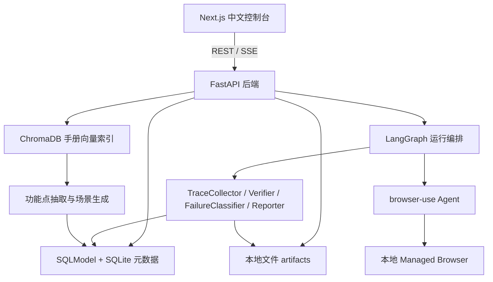
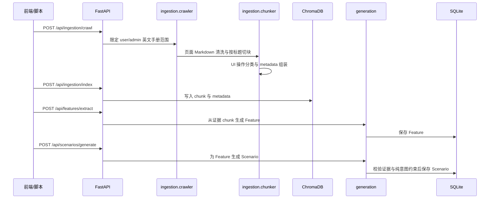
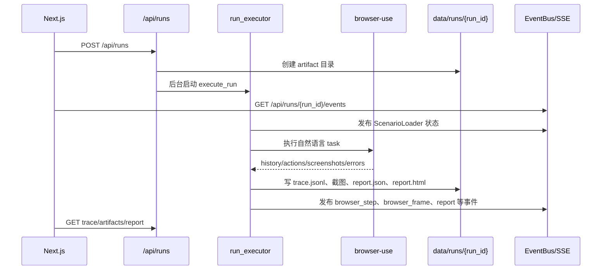

# SpecPilot 系统架构与模块实现说明

本文面向项目交接、答辩说明和后续开发维护，集中描述 SpecPilot 的系统架构、技术栈、核心数据流以及当前仓库中各模块的具体实现。更细粒度的接口、数据模型、测试要求仍以 `PLANv2.md`、`docs/API.md`、`docs/SCHEMAS.md` 和 `docs/TESTING.md` 为准。

## 1. 系统定位

SpecPilot 是一个本地运行的全栈 Web 测试系统，目标是把 4ga Boards 的用户/管理员手册转化为可执行测试场景，再由大模型 Web Agent 自动执行，并结合确定性校验与视觉校验判断功能是否正确。

系统覆盖两条主链路：

1. 手册知识链路：爬取 4ga Boards 英文 user/admin 手册，清洗、切分、分类、索引，然后抽取功能点并生成带手册证据的结构化测试场景。
2. 测试执行链路：前端选择场景创建 run，后端用 LangGraph 编排运行阶段，由 `browser-use` 执行浏览器交互，写入 trace、截图、报告，并在前端实时展示执行过程。

MVP 的关键边界是：浏览器执行只使用 `browser-use`；测试场景只保存自然语言用户意图和结构化预期，不保存 DOM 定位信息；CDP 视频流和完整变异生成算法只保留接口边界，不作为 MVP 主链路实现。

## 2. 总体架构



架构分层如下：

| 层级 | 责任 | 当前实现位置 |
| --- | --- | --- |
| 前端控制台 | 中文 App Shell、功能点树、场景表、执行记录、实时执行视图、系统设置 | `frontend/app/`、`frontend/components/`、`frontend/lib/` |
| API 层 | 暴露 ingestion、features、scenarios、runs、settings、doctor、reports、mutations 等接口 | `backend/src/specpilot_backend/api/` |
| 业务服务层 | 持久化、artifact 管理、trace 写入、run 执行调度 | `backend/src/specpilot_backend/services/` |
| 手册处理层 | 爬取范围过滤、清洗、按标题切块、UI 操作分类、ChromaDB 写入 | `backend/src/specpilot_backend/ingestion/` |
| 生成层 | 功能点生成、场景生成、证据校验、纯意图场景校验、prompt 模板 | `backend/src/specpilot_backend/generation/`、`backend/src/specpilot_backend/prompts/` |
| Agent 层 | browser-use 任务构造、浏览器会话、LLM 适配、运行结果归一化、LangGraph 节点 | `backend/src/specpilot_backend/agent/` |
| 验证与报告层 | 确定性校验、GLM-4.6V 视觉校验、仲裁、失败分类、HTML/JSON 报告 | `backend/src/specpilot_backend/verification/`、`backend/src/specpilot_backend/failures/`、`backend/src/specpilot_backend/reports/` |
| 数据契约层 | Feature、Scenario、Run、TraceEvent、Verification、Mutation 等模型 | `backend/src/specpilot_backend/models/` 与 `frontend/lib/types.ts` |

## 3. 技术栈

### 3.1 前端

| 技术 | 用途 |
| --- | --- |
| Next.js App Router 14 | 前端路由、页面组织、服务端/客户端组件基础 |
| TypeScript | 前端类型约束，与后端 schema 保持一致 |
| Tailwind CSS | 页面布局、状态色、控制台样式 |
| Radix UI | 设置抽屉、弹层、菜单、标签页等基础交互 |
| Lucide Icons | 侧边栏、按钮、状态图标 |
| TanStack Query | REST 数据请求、缓存、轮询 |
| Zustand | App Shell 状态，例如侧边栏折叠、设置抽屉开关 |
| React Flow | 实时执行页展示 LangGraph 节点状态 |
| Recharts | 工作台统计与分布图表 |
| @microsoft/fetch-event-source | 订阅 run 事件 SSE |

### 3.2 后端

| 技术 | 用途 |
| --- | --- |
| FastAPI | REST API、SSE 接口、健康检查 |
| Pydantic v2 / pydantic-settings | 请求响应模型、运行配置、密钥字段保护 |
| SQLModel + SQLite | 本地元数据持久化，保存 feature、scenario、run 记录 |
| ChromaDB | 手册 chunk 向量索引 |
| crawl4ai | 抓取并转换 4ga Boards 手册页面 |
| langchain-text-splitters | 架构约定中的文本切分能力；当前 chunker 已实现标题优先切分 |
| sentence-transformers | 手册 embedding 能力 |
| LangGraph | 运行编排层，负责场景加载、执行交接、trace、验证、分类、报告等阶段 |
| browser-use | 唯一浏览器执行器，承担单场景内部观察、规划、点击、输入、拖拽等循环 |
| langchain-deepseek | 默认文本模型 DeepSeek V4 Pro 的接入方式 |
| GLM-4.6V 后端适配器 | 视觉校验通道 |
| sse-starlette / StreamingResponse | run 事件流输出 |

### 3.3 运行环境

Python 环境由仓库根目录的 `uv` 管理，Python 版本范围为 `>=3.11,<3.13`，推荐 `3.12`。后端源码位于 `backend/src/specpilot_backend/`，测试位于 `backend/tests/`。前端使用 `pnpm` 管理依赖。

## 4. 核心设计原则

### 4.1 纯意图测试场景

场景步骤只表达用户要做什么，例如“在目标 List 中打开添加 Card 的入口”，不保存运行时 DOM 细节。元素识别由 `browser-use` 在执行时根据当前页面观察完成。这样可以减少手册证据之外的信息幻觉，也能降低 UI 改版对场景的影响。

当前后端在 `backend/src/specpilot_backend/models/scenarios.py` 中通过递归校验拒绝禁止字段；`backend/src/specpilot_backend/generation/validators.py` 会在生成入库前再次校验 payload。

### 4.2 browser-use 是唯一执行器

`browser-use` 承担单个场景内部的 Agent loop：观察页面、选择动作、执行动作、判断是否完成。项目不实现第二套浏览器执行后备方案，也不注册 4ga Boards 专用动作。

当前实现中，`backend/src/specpilot_backend/agent/browser_use_runner.py` 负责：

- 创建 `Browser(headless=..., user_data_dir=None, allowed_domains=[...])`；
- 根据设置选择 DeepSeek 适配模型或 Browser Use hosted LLM；
- 构建 `sensitive_data`，避免把账号密码写进 task 文本；
- 调用 `Agent(...).run(max_steps=scenario.max_steps)`；
- 将 browser-use history 归一化为 `BrowserUseRunResult`。

### 4.3 LangGraph 负责场景外编排

LangGraph 不重复实现 browser-use 内部决策循环，而是组织执行前后的系统工作：加载场景、调用 browser-use、收集 trace、运行验证、分类失败、生成报告。

当前 `backend/src/specpilot_backend/agent/workflow.py` 已定义 `ScenarioLoader`、`BrowserUseRun`、`TraceCollector` 等节点骨架；实际 run 服务在 `backend/src/specpilot_backend/services/run_executor.py` 中按同样阶段发布 `TraceEvent`，用于 API 和前端展示。

### 4.4 双通道验证

验证由两类信号组成：

- 确定性校验：基于 DOM 文本、URL、HTML 快照、可访问性树判断 `element_visible`、`text_present`、`url_match`、`element_state`、`containment`。
- 视觉校验：对 `semantic` 预期或显式要求视觉判断的场景调用 GLM-4.6V，返回结构化 verdict、confidence、reason。

`backend/src/specpilot_backend/verification/arbitration.py` 实现仲裁规则：不能把 browser-use 自报成功直接当作测试通过；当 DOM 与视觉结论冲突时，按置信度和冲突类型进入失败或人工复核。

## 5. 运行时数据流

### 5.1 手册到场景



当前仓库中，爬取和切块能力已实现为可测试模块；API 中部分 job 接口返回 queued，用于保持契约形状。演示数据可通过 `backend/src/specpilot_backend/scripts/seed_demo.py` 写入本地库。

### 5.2 场景到报告



当前 `execute_run` 会加载第一个 scenario，调用 browser-use runner，捕获 browser-use 日志并脱敏，发布节点状态和浏览器帧事件，最终生成 JSON/HTML 报告。完整的确定性快照采集、视觉调用与分类闭环已有独立模块和测试覆盖，主执行服务会随着里程碑继续把这些模块串得更完整。

## 6. 后端模块实现

### 6.1 配置与启动

`backend/src/specpilot_backend/config.py` 定义 `Settings`：

- 本地路径：`database_url`、`artifact_root`、`chroma_persist_dir`；
- 目标地址：`docs_base_url`、`target_app_url`；
- 模型设置：`text_llm_provider` 默认 `openai_compatible`，`openai_compatible_model` 默认 `gpt-5.5`，旧 `deepseek_model=deepseek-v4-pro` 保留兼容，GLM 默认 `glm-4.6v`；
- browser-use 执行设置：headless、允许域、最大步数、重试次数；
- 验证阈值：高置信度 `0.85`，低置信度 `0.60`。

配置校验会拒绝启用 Browser Use Cloud Browser；OpenAI-compatible key 可在启动时为空，但 Doctor 会在选中该 provider 且缺少 key/base URL/model 时给出 warning。

`backend/src/specpilot_backend/main.py` 创建 FastAPI app，在 lifespan 中调用 `create_tables()`，并挂载所有 API router，同时提供 `GET /health`。

### 6.2 数据模型

`backend/src/specpilot_backend/models/` 保存后端 Pydantic 契约：

- `features.py`：Feature 模型，限定模块枚举、证据 URL、证据 quote、覆盖状态。
- `scenarios.py`：TestStep、Expectation、TestScenario，使用 `extra="forbid"` 与递归字段检查保证场景结构干净。
- `mutations.py`：MutatedScenario 继承 TestScenario，增加 mutation 元数据和检测结果字段。
- `runs.py`：Run 状态、耗时、verdict、artifact 目录和 report id。
- `events.py`：TraceEvent，统一 SSE 与 `trace.jsonl` 的事件格式。
- `verification.py`：VerificationResult、VerificationFailure、FailureClassification。

前端的 `frontend/lib/types.ts` 手动镜像这些类型，用于 API client 和组件 props。

### 6.3 持久化

`backend/src/specpilot_backend/services/persistence.py` 使用 SQLModel 定义三张表：

- `FeatureRecord(feature_id, payload_json)`；
- `ScenarioRecord(scenario_id, feature_id, review_status, priority, difficulty, is_mutation, latest_result, payload_json)`；
- `RunRecord(run_id, status, artifact_dir, payload_json, created_at)`。

当前实现采用“索引字段 + JSON payload”的轻量方式：常用筛选字段独立建列，完整业务对象以 UTF-8 JSON 保存，便于快速保持 API schema 与数据库记录一致。

### 6.4 API 路由

`backend/src/specpilot_backend/api/` 按业务域拆分：

- `ingestion.py`：`POST /api/ingestion/crawl`、`POST /api/ingestion/index`，返回 job id 与 queued 状态。
- `features.py`：触发功能点抽取任务、列出已保存 feature。
- `scenarios.py`：触发场景生成、按 feature/priority/difficulty/status/latest_result/is_mutation 过滤、读取完整 scenario。
- `runs.py`：创建 run、列出 run、读取 run、SSE 事件、trace、artifacts、report 导出。
- `mutations.py`：MVP stub，返回合法的空 mutations 列表。
- `reports.py`：按 report id 返回报告元数据。
- `settings.py`：返回模型与密钥 configured 状态；密钥字段只写不读；拒绝云浏览器开关。
- `doctor.py`：检查模型配置、browser-use 安装、数据库、ChromaDB 目录、artifact 目录、场景纯意图约束等准备状态。

### 6.5 Artifact 与 Trace

`backend/src/specpilot_backend/services/artifacts.py` 负责 run 目录创建、安全路径解析和 artifact 列表。路径解析限定在 `data/runs/{run_id}/` 内，防止任意文件读取。

`backend/src/specpilot_backend/services/trace_writer.py` 以 append-only 方式写入 `trace.jsonl`。写入前会把 payload 中的 base64 图片体替换为占位描述，避免 trace 文件膨胀；截图通过 artifact 路径引用。

`backend/src/specpilot_backend/events/bus.py` 提供内存事件总线，`events/sse.py` 支持实时订阅和 trace 回放。当前前端如果 SSE 中断，也会定时拉取 trace 和 artifacts 补齐显示。

### 6.6 手册爬取与索引

`backend/src/specpilot_backend/ingestion/crawler.py` 实现 4ga Boards 手册范围控制：

- 只允许 `docs.4gaboards.com`；
- 只保留英文 `user-manual` 和 `admin-manual`；
- 排除 developer/API/deployment/database/install/CLI 等非 UI 操作内容；
- 从链接中推断 manual section、module、module variant。

`chunker.py` 采用标题优先切分：先按 `#`、`##`、`###` 拆成章节，再对超长内容按词数窗口切分，默认 `chunk_size=400`、`overlap=50`。每个 chunk 写入 source URL、page title、heading path、section anchor、content hash、module、UI 操作分类等 metadata。

`classifier.py` 提供 UI 操作分类 prompt 和保守的模块推断逻辑。`indexer.py` 将 chunk 写入 ChromaDB，并对 metadata 做 Chroma 可接受的类型清洗。

### 6.7 功能点与场景生成

`backend/src/specpilot_backend/prompts/templates.py` 固化 prompt 合约，要求模型输出结构化 JSON 并携带证据约束。

`generation/features.py` 当前根据 UI operational chunk 按 module 与标题聚合，生成 Feature payload，保留 source URL 与 evidence quote，并可选择直接持久化。

`generation/scenarios.py` 当前为每个 feature 构造可执行场景 payload。Card 创建场景有专门模板，其它模块走通用模板；字段包括 priority、difficulty、preconditions、test_data、steps、expectations、max_steps、review_status。

`generation/validators.py` 执行两类关键校验：

- evidence quote 必须来自提供的手册 chunk；
- scenario payload 不能包含被禁止的 DOM 定位字段。

### 6.8 browser-use 执行适配

`backend/src/specpilot_backend/agent/task_builder.py` 将 TestScenario 转成 browser-use task 字符串。它会包含目标应用、前置条件、非敏感测试数据、步骤和执行规则，但不会把 expectations 放进 task；预期结果只给后置 verifier 使用。

`agent/browser_use_runner.py` 完成实际 browser-use 集成：

- `create_browser_session()` 创建本地浏览器会话；
- `create_browser_use_llm()` 根据设置选择 OpenAI-compatible、DeepSeek 兼容路径或 Browser Use hosted LLM；
- `build_sensitive_data()` 把 4ga 凭据放入 browser-use 敏感数据机制；
- `run_scenario_with_browser_use()` 构造 Agent 并执行；
- `history_to_run_result()` 抽取 success、final result、URLs、action names、screenshots、errors、steps。

`services/run_executor.py` 是 API 创建 run 后的后台执行入口。它负责 run 状态推进、trace 写入、SSE 发布、browser-use 日志捕获、截图复制、报告生成和异常兜底。Windows 下如果当前 loop 不适配 browser-use 所需事件循环，会在线程中创建 Proactor loop 执行 runner。

### 6.9 验证、仲裁与失败分类

`verification/deterministic.py` 定义 `VerificationSnapshot`，并按 expectation type 分发检查：

- `element_visible`：检查文本是否可见，必要时结合容器文本和可访问性树；
- `text_present`：检查文本存在或不存在；
- `url_match`：支持 pattern、contains、equals；
- `element_state`：从可访问性树或 HTML 属性中判断状态；
- `containment`：判断 child 文本是否位于 parent 文本语义范围内；
- `semantic`：返回 needs_review，由视觉校验处理。

`verification/vision_glm.py` 定义 GLM-4.6V 请求、响应解析和阈值处理。它要求视觉模型返回 JSON，并把低置信度结果转为 `needs_review`。

`verification/arbitration.py` 实现 DOM/视觉仲裁矩阵。只要任一通道需要复核，就不会强行通过；DOM 通过但视觉失败会作为真实失败；DOM 失败但视觉通过会进入软失败复核。

`failures/classifier.py` 使用规则优先的方式把 `VerificationFailure` 映射到 `navigation_failure`、`element_not_found`、`interaction_failure`、`timing_issue`、`state_mismatch`、`visual_regression`、`agent_planning_error`、`dom_mismatch_visually_correct` 或 `unknown`，并输出 primary 与 secondary。

### 6.10 报告生成

`reports/generator.py` 生成两个文件：

- `report.json`：保存 run summary、verification results、trace events、failure classification、artifact links；
- `report.html`：把同样内容渲染为中文页面可打开的 HTML 报告。

报告生成前会递归脱敏，字段名中包含 `api_key`、`password`、`secret`、`token`、`credential`、`authorization` 等关键字的值会替换为 `[REDACTED]`。

## 7. 前端模块实现

### 7.1 App Shell

`frontend/app/layout.tsx` 使用 `Providers` 包裹全局 QueryClient 和 App Shell。`components/app-shell/app-shell.tsx` 实现固定顶部栏、可折叠侧边栏和主内容区。

导航项包括：

- 工作台 `/`；
- 功能点树 `/features`；
- 测试场景 `/scenarios`；
- 执行过程 `/runs/live`；
- 执行记录 `/runs`。

顶部栏显示当前模型、控制台状态、通知按钮和系统设置入口。

### 7.2 API Client 与状态

`frontend/lib/api.ts` 封装所有 REST 调用，包括 feature、scenario、run、artifact、report、settings、doctor。默认 API base URL 为空，依赖 Next.js 代理；也支持 `NEXT_PUBLIC_API_BASE_URL`。

`frontend/lib/sse.ts` 使用 `fetch-event-source` 订阅 `/api/runs/{run_id}/events`，把后端 `TraceEvent` 推给实时执行页面。

`frontend/lib/store.ts` 使用 Zustand 保存侧边栏折叠和设置抽屉开关状态。

### 7.3 工作台

`frontend/app/page.tsx` 聚合 feature、scenario、run 数据，展示数量、通过率、失败分布、平均耗时、最近运行和快捷入口。它是默认首页，不做营销页，直接呈现测试控制台。

### 7.4 功能点树

`components/features/feature-tree.tsx` 按模块排序展示 Feature，支持模块分组、覆盖状态、证据 quote、来源 URL、置信度与摘要信息。`frontend/app/features/page.tsx` 承载页面标题与 FeatureTree。

### 7.5 测试场景

`components/scenarios/scenario-table.tsx` 展示场景表、筛选器、运行按钮和详情抽屉。详情抽屉显示：

- preconditions；
- steps；
- expectations；
- test data；
- source URLs；
- evidence quotes；
- 完整 JSON。

点击运行会调用 `api.createRun()`，后端返回 live URL 后跳转实时执行页。

### 7.6 执行记录与详情

`components/runs/run-history.tsx` 展示历史 run 表格，包括状态、verdict、耗时、失败分类和详情入口。

`components/runs/run-detail.tsx` 展示单个 run 的 summary、trace、artifact 列表和 JSON/HTML/PDF report 链接。PDF 只在后端 artifact 存在时可下载。

### 7.7 实时执行页

`components/live/live-run-console.tsx` 是实时执行页面核心。它同时使用三类数据源：

- SSE 实时 TraceEvent；
- `/api/runs/{run_id}/trace` 定时回放；
- `/api/runs/{run_id}/artifacts` 定时发现截图。

页面由四块组成：

- `AgentFlow`：React Flow 展示 ScenarioLoader、BrowserUseRun、TraceCollector、DeterministicVerifier、VisionVerifier、FailureClassifier、RepairPlanner、Reporter 等节点状态；
- `EventStream`：按时间展示 node status、browser step、verification、classification、report、error；
- `BrowserFrameView`：显示最新截图，并在 payload 存在 bounding box 时叠加目标框；
- `FrameTimeline`：展示历史截图缩略时间线。

这使后端即使只提供 per-step 截图，也能在前端形成接近实时的执行观察体验。

### 7.8 系统设置

`components/app-shell/settings-drawer.tsx` 实现设置抽屉：

- 文本模型：单一 OpenAI-compatible / Codex API 配置表单；
- 供应商名称、备注、官网链接、API 请求地址和模型名输入；
- API key 写入控件，只显示 configured/empty，不回显密钥；
- GLM-4.6V 模型名；
- doctor 检查结果展示。

后端 `PATCH /api/settings` 会把模型相关配置写入仓库根目录 `.env`，保留未知 key 和注释；密钥只写不读，空 API key 不覆盖已有值。

## 8. 本地数据与目录

运行时数据默认位于：

```text
data/
  specpilot.db
  chroma/
  runs/
    {run_id}/
      trace.jsonl
      browser-use.log
      report.json
      report.html
      screenshots/
      dom/
      verification/
```

SQLite 保存轻量元数据和 JSON payload；ChromaDB 保存手册向量索引；大文件、trace、截图、报告保存在文件系统中，并通过 `run_id` 关联。

## 9. 安全与隐私约束

项目对密钥和凭据采取以下约束：

- `.env` 不提交；
- Settings 中密钥字段使用 `SecretStr`；
- settings API 只返回 configured 布尔值；
- browser-use task 不包含账号密码；
- 运行日志捕获会替换已知密钥值；
- trace 不保存 base64 截图体；
- report 生成时按敏感字段名递归脱敏；
- artifact 文件访问必须经过 run 目录边界检查。

## 10. 测试与验收

后端测试集中在 `backend/tests/`，覆盖配置、schema、API、artifact 安全、chunker、爬取范围、生成校验、prompt 合约、trace event、run execution、verification、failure classifier、report、doctor、demo seed 等模块。

常用后端验证命令：

```bash
uv run pytest
uv run ruff check .
uv run pyright
```

常用前端验证命令：

```bash
cd frontend
pnpm lint
pnpm typecheck
pnpm build
```

本地演示数据：

```bash
uv run python -m specpilot_backend.scripts.seed_demo
```

后端启动：

```bash
uv run uvicorn specpilot_backend.main:app --host 127.0.0.1 --port 8000
```

前端启动：

```bash
cd frontend
pnpm dev --hostname 127.0.0.1 --port 3000
```

## 11. 当前实现状态摘要

当前仓库已经具备完整的项目骨架与主要 MVP 模块：

- 已实现配置、模型、API 契约、SQLite 持久化、artifact 安全访问；
- 已实现手册范围过滤、标题优先 chunk、UI 操作分类、ChromaDB 写入辅助；
- 已实现功能点/场景 payload 生成与证据、纯意图约束校验；
- 已实现 browser-use 本地执行适配、敏感数据注入、run 后台执行、SSE/trace、截图 artifact 和报告生成；
- 已实现确定性 verifier、GLM 视觉 verifier 适配、仲裁和失败分类的独立模块；
- 已实现中文 Next.js 控制台的主要页面和实时执行可视化。

需要特别注意的是：MVP 架构已经定义了完整的验证与失败分类闭环，相关模块也已经存在；当前 run 执行服务的主流程仍以 browser-use history 和报告落盘为主，验证快照采集、视觉调用、仲裁结果、失败分类事件在执行链路中的深度串联应继续严格按 `docs/IMPLEMENTATION_PLAN.md` 的里程碑推进。
